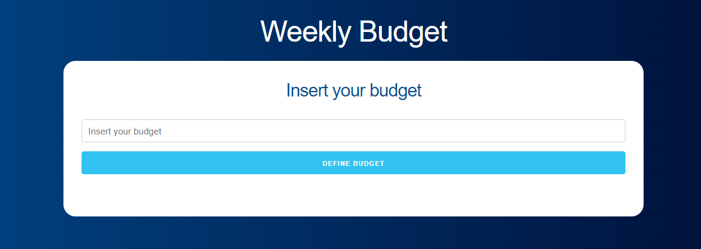

# <div align="center">📋 Veterinary Appointment App</div>

<a href="https://epic-nobel-6e19d0.netlify.app/">

                             </a>
<p align="center">A simple, Veterinary appointment application built with React and Hooks 📋. You can create & delete an appointment with it</p>

## 🛠️ Technologies

<ul>
  <li><a href="https://reactjs.org/">React</a></li>
  <li><a href="https://skeleton-framework.github.io/">Skeleton framework</a></li>
</ul>

## ⚙️ Requirements

<ul>
  <li><a href="https://git-scm.com/">Git</a></li>
  <li><a href="https://nodejs.org/en/">Node.js</a></li>
  <li><a href="https://www.npmjs.com/">NPM</a></li>
</ul>

## 🚀 Installation

```
$ git clone https://github.com/cneme23/PetShopAppointmentApp.git
$ cd petShopApp/PetShopAppointmentApp
$ npm install
$ npm start
```

The application will open in the browser on http://localhost:3000
